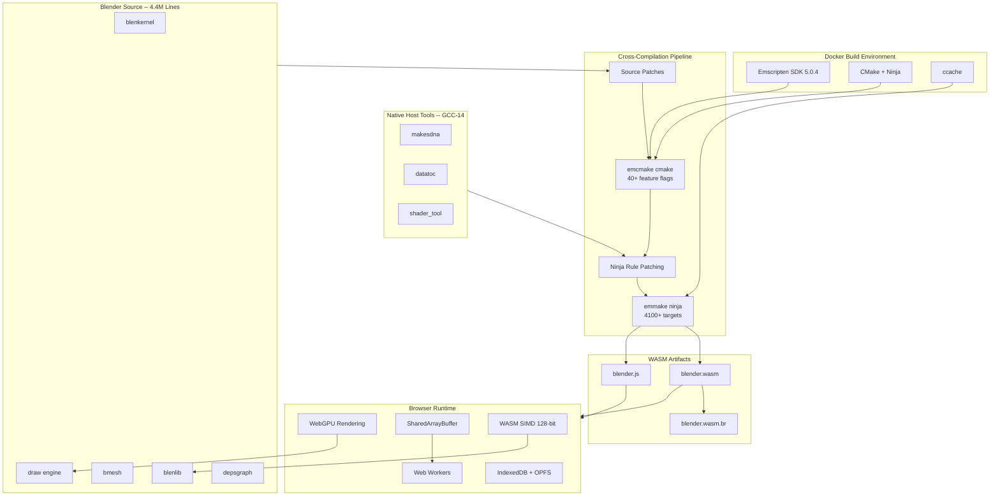

<div align="center">

# BlendNet

*Full Blender, compiled to WebAssembly. No installation required.*

The complete Blender 3D creation suite -- 4.4 million lines of C/C++ -- cross-compiled to WebAssembly via Emscripten. Modeling, sculpting, animation, physics, rendering, all running client-side in a browser tab.


[](https://github.com/LakshmanTurlapati/BlendNet/stargazers)
[](https://github.com/LakshmanTurlapati/BlendNet/issues)
[](https://github.com/LakshmanTurlapati/BlendNet/commits/main)

</div>

---

<div align="center">

[The Problem](#the-problem) · [The Solution](#the-solution) · [Features](#features) · [How It Works](#how-it-works) · [Architecture](#architecture) · [Tech Stack](#tech-stack) · [Project Structure](#project-structure) · [Quick Start](#quick-start) · [Roadmap](#roadmap) · [Contributing](#contributing)

</div>

---

## The Problem

Blender is the most powerful open-source 3D creation suite on the planet. But using it means downloading 500+ MB, installing it on your machine, and hoping your OS and GPU drivers cooperate. You can't try Blender on a school computer, a Chromebook, a friend's laptop, or a locked-down corporate machine without admin rights.

Sharing a Blender workflow starts with "first, install Blender." Tutorials link to download pages. Classrooms need IT to image every workstation. Collaborators on different platforms deal with version mismatches. And the WebGL-based 3D viewers that exist online are read-only -- you can orbit a model, but you can't model, sculpt, animate, simulate, or render.

There's no "just open Blender in your browser" option. Not because it's impossible -- WebAssembly, WebGPU, and SharedArrayBuffer have made the browser a viable compute platform -- but because nobody has done the work of compiling 4.4 million lines of C/C++ to run there.

## The Solution

BlendNet is that work.

It takes the full Blender source code -- the same codebase that ships as the desktop application -- and cross-compiles it to WebAssembly using Emscripten. Same engine. Same geometry kernel. Same physics solvers. Same rendering pipelines. Running entirely client-side in the browser with no plugins, no installation, and no server-side processing.

GPU-accelerated rendering comes through WebGPU (Cycles and EEVEE), with WebGL2 as a fallback for basic viewport shading. Multi-threading uses SharedArrayBuffer and Web Workers for parallel computation. WASM SIMD handles vectorized math. File persistence uses IndexedDB and the Origin Private File System so your work survives across sessions.

Open a URL. Start modeling. That's it.

---

## Features

| Feature | Description |
|---|---|
| **Full Engine Compilation** | The complete Blender C/C++ codebase (4.4 million lines) cross-compiled to WebAssembly via Emscripten. Not a viewer, not a subset -- the real engine. |
| **WebGPU Rendering** | GPU-accelerated rendering through WebGPU for Cycles path tracing and EEVEE real-time preview. WebGL2 fallback for basic viewport shading when WebGPU is unavailable. |
| **Multi-Threaded** | SharedArrayBuffer and Web Workers provide parallel computation with COOP/COEP cross-origin isolation. Thread count scales to available hardware cores. |
| **SIMD Acceleration** | 128-bit WASM SIMD instructions for geometry processing, physics simulation, and math-heavy operations. Validated at runtime with feature detection. |
| **Docker Build Pipeline** | Fully reproducible build environment using Docker and Emscripten SDK. One command produces the WASM binary. Idempotent -- reruns pick up where they left off. |
| **Native Host Tool Bridge** | Blender's build-time code generators (makesdna, datatoc, shader_tool) are compiled natively with GCC-14 and patched into the WASM build via ninja rule rewriting. Solves the cross-compilation chicken-and-egg problem. |
| **Browser Storage** | IndexedDB and Origin Private File System (OPFS) for client-side file persistence. Projects, assets, and preferences survive across sessions without a server. |
| **Brotli Compression** | WASM binary compressed with Brotli for optimized delivery. Streaming compilation via `WebAssembly.instantiateStreaming` for fast startup. |

---

## How It Works

1. **Docker environment starts** -- A reproducible Emscripten 5.0.4 container boots with all build tools (CMake, Ninja, ccache, GCC-14, Brotli).
2. **Dependencies install** -- Brotli, Zstd, Freetype, fmt, and Epoxy are built into the Emscripten sysroot. Eigen3 headers and sse2neon stubs are placed for cross-platform math support.
3. **Source patches apply** -- Version-controlled `.wasm32.patch` files adapt Blender's source for WASM32 compatibility (struct sizes, platform abstractions, storage backends).
4. **Native host tools build** -- makesdna, datatoc, and shader_tool are compiled with GCC-14 to run natively inside the container. These generate DNA type files, data-to-C arrays, and 500+ shader metadata files that Blender needs at build time.
5. **CMake configures for WASM** -- `emcmake cmake` configures Blender with Emscripten's toolchain, WASM-specific compile flags (SIMD, threading, memory limits), and 40+ feature toggles for the headless build profile.
6. **Ninja is patched** -- The generated `build.ninja` is rewritten to replace WASM-compiled host tool invocations with native executables, bridging the cross-compilation gap.
7. **Blender compiles to WASM** -- `emmake ninja` cross-compiles the engine to WebAssembly. The output is `blender.wasm`, `blender.js` (Emscripten glue), and a Brotli-compressed `blender.wasm.br` for serving.

---

## Architecture



---

## Tech Stack

**Core**


**Cross-Compilation**


**Browser Runtime**


**Build Environment**


**Testing**


---

## Project Structure

```
BlendNet/
├── Blender Mirror/                          # Full Blender source (git submodule)
│   ├── source/blender/                      # Core engine (blenkernel, blenlib, bmesh, draw, etc.)
│   ├── intern/                              # Internal libraries (cycles, ghost, guardedalloc)
│   ├── build_files/cmake/                   # Upstream CMake build system
│   └── CMakeLists.txt                       # Root Blender build config (2000+ lines)
│
├── cmake/                                   # WASM build configuration
│   ├── emscripten_overrides.cmake           # WASM compile/link flags (SIMD, threading, memory)
│   ├── emscripten_platform_overrides.cmake  # Platform abstraction overrides
│   ├── wasm_sources.cmake                   # Custom entry point and include paths
│   ├── wasm_toolchain.cmake                 # Emscripten toolchain configuration
│   ├── host_tools/
│   │   └── CMakeLists.txt                   # Standalone native host tools build
│   ├── fake_modules/                        # CMake Find* stubs for disabled dependencies
│   ├── stubs/                               # Header stubs (OpenImageIO, etc.)
│   └── wasm_find_modules/                   # WASM-specific dependency finders
│
├── scripts/                                 # Build pipeline scripts
│   ├── build-wasm-full.sh                   # End-to-end build orchestrator (7 stages)
│   ├── build-wasm.sh                        # Stage 3: WASM cross-compilation
│   ├── build-host-tools.sh                  # Stage 2: Native GCC-14 host tools
│   ├── build-wasm-deps.sh                   # Stage 3: Emscripten port verification
│   ├── setup-wasm-deps.sh                   # Stage 1: System dependency installation
│   ├── patch-ninja-host-tools.sh            # Stage 5: Ninja rule rewriting
│   ├── run-wasm-generator.sh                # Run WASM-compiled generators via Node.js
│   ├── test-wasm-load.js                    # WASM binary load test
│   ├── test-main-loop.js                    # Main loop initialization test
│   ├── test-memory.js                       # Memory allocation test
│   └── test-threading.js                    # SharedArrayBuffer threading test
│
├── patches/                                 # Source compatibility patches
│   ├── CMakeLists.wasm.patch                # CMake build system adaptations
│   ├── BLI_resource_scope.wasm32.patch      # Resource scope WASM32 fixes
│   ├── platform_unix.wasm32.patch           # Platform abstraction for Emscripten
│   └── storage.wasm32.patch                 # Storage backend adaptations
│
├── source/
│   └── wasm_headless_main.cc                # Custom WASM entry point (replaces creator.cc)
│
├── web/
│   ├── index.html                           # Browser test harness (feature detection + WASM load)
│   └── serve.py                             # Local development server with COOP/COEP headers
│
├── docs/
│   └── BUILD_STATUS.md                      # Current build progress and pipeline documentation
│
├── build-native/                            # Native host tool build output (makesdna, datatoc, shader_tool)
├── build-wasm/                              # WASM build output (blender.wasm, blender.js)
├── Dockerfile                               # Emscripten 5.0.4 build environment
├── docker-compose.yml                       # Docker service configuration
├── CLAUDE.md                                # AI assistant project context
└── .gitignore
```

---

## Quick Start

### Prerequisites

- [Docker](https://www.docker.com/) and Docker Compose
- 16 GB+ RAM (Blender compilation is memory-intensive)
- 20 GB+ free disk space (Blender source + build artifacts)

### Build

```bash
# Clone the repository
git clone https://github.com/LakshmanTurlapati/BlendNet.git
cd BlendNet

# Build the Docker environment
docker compose build blender-wasm-build

# Run the full 7-stage build pipeline
docker compose run --rm blender-wasm-build bash scripts/build-wasm-full.sh
```

The pipeline is idempotent -- rerunning picks up where it left off thanks to Ninja's incremental build support and ccache.

### Test in Browser

```bash
# Start the development server with COOP/COEP headers
cd web
python3 serve.py

# Open http://localhost:8080 in Chrome 113+, Firefox 120+, or Safari 17.4+
```

The test harness validates cross-origin isolation, SharedArrayBuffer, WASM SIMD, streaming compilation, and module initialization.

### Interactive Debug

```bash
# Drop into the build container for manual debugging
docker compose run --rm blender-wasm-build bash

# Inside the container:
cd /src/build-wasm
ninja -j1 2>&1 | tail -50
```

---

## Roadmap

| Phase | Description | Status |
|---|---|---|
| **1. WASM Build Infrastructure** | Docker environment, Emscripten toolchain, native host tool bridge, CMake configuration for 4100+ targets, ninja patching, source compatibility patches | In Progress |
| **2. Core Engine Compilation** | Resolve remaining Emscripten compatibility issues (fenv.h, platform stubs), compile all 3114 build targets, produce blender.wasm | Planned |
| **3. Headless Geometry Pipeline** | Mesh creation, modifier stack evaluation, geometry nodes execution running in WASM without a display | Planned |
| **4. WebGPU Viewport** | Port GHOST (Blender's platform abstraction) to the browser, initialize WebGPU context, basic 3D viewport rendering | Planned |
| **5. EEVEE Renderer Port** | Adapt EEVEE's OpenGL/Vulkan backend to WebGPU, shader cross-compilation, real-time viewport shading | Planned |
| **6. UI System** | Port Blender's immediate-mode UI to the browser, input handling, window management, editor layout system | Planned |
| **7. Python Scripting** | Integrate Pyodide for in-browser Python execution, bpy API bindings, pure-Python addon support | Planned |
| **8. File I/O and Persistence** | .blend file read/write via IndexedDB and OPFS, drag-and-drop import, export to local filesystem via File System Access API | Planned |
| **9. Full Feature Parity** | Cycles path tracing via WebGPU compute, animation playback, physics simulation, compositor, sequencer | Planned |

---

## Contributing

1. **Fork** the repository
2. **Create** a feature branch (`git checkout -b feature/your-feature`)
3. **Commit** your changes (`git commit -m "Add your feature"`)
4. **Push** to the branch (`git push origin feature/your-feature`)
5. **Open** a Pull Request

**Architecture notes for contributors:** The project wraps the upstream Blender source (`Blender Mirror/`) without modifying it directly -- all adaptations go through `patches/*.wasm32.patch` files, `cmake/` overrides, and the custom entry point at `source/wasm_headless_main.cc`. The build pipeline runs inside Docker via `scripts/build-wasm-full.sh` (7 stages). If you're fixing a compilation issue, the pattern is: identify the failing source file, create a minimal `.wasm32.patch`, and add the necessary CMake definitions in `cmake/emscripten_overrides.cmake`.

---

## License

[GPL-2.0-or-later](https://spdx.org/licenses/GPL-2.0-or-later.html) (same as Blender)

---

<div align="center">

Built by [Lakshman Turlapati](https://github.com/LakshmanTurlapati)

If BlendNet convinced you that Blender belongs in a browser tab, consider giving it a star.

</div>
